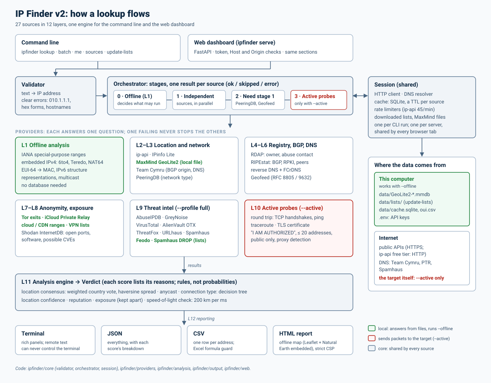
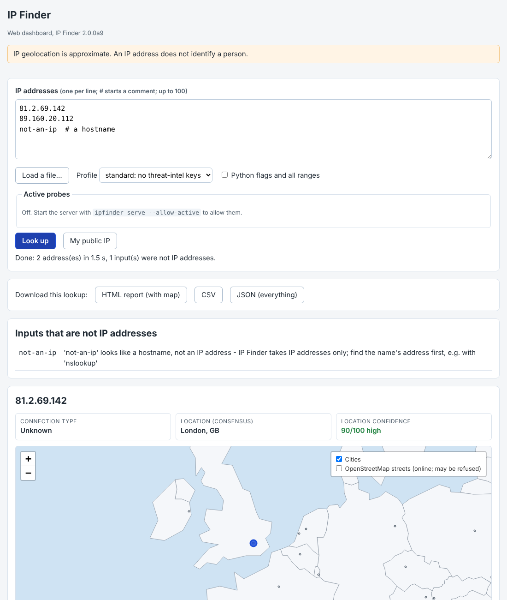
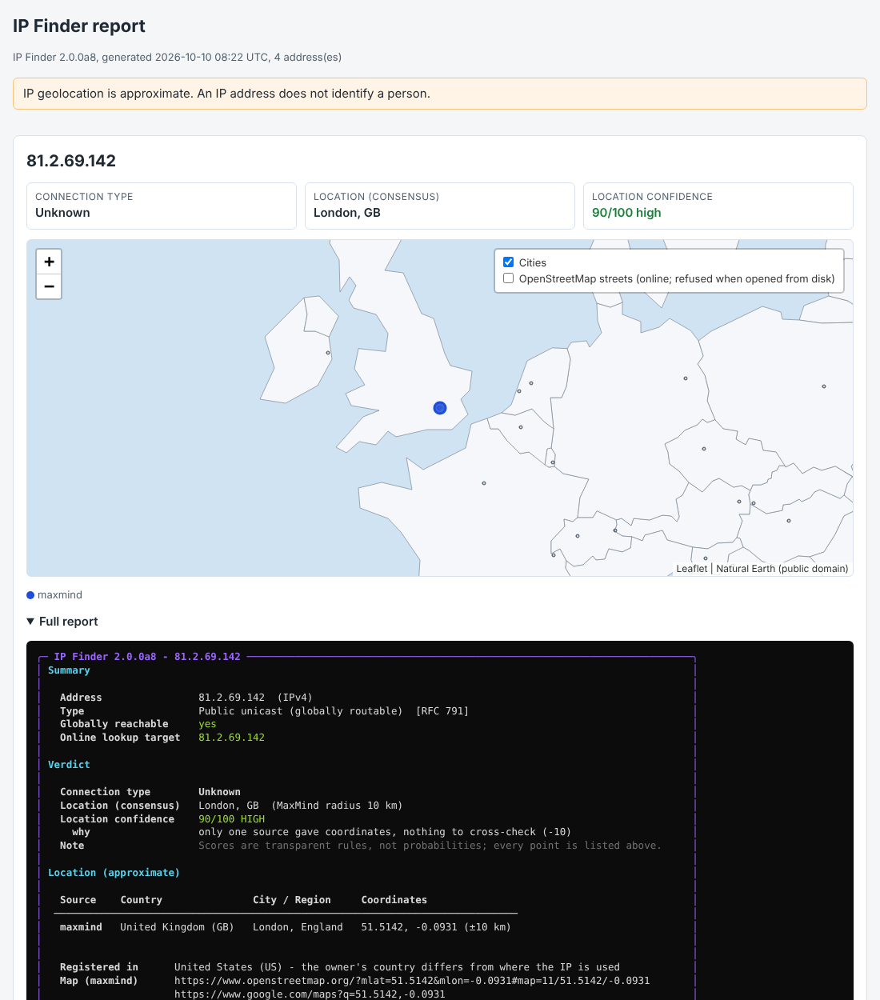

# IP Finder v2 (Phase 0–10)

একটি IP address থেকে **আইনসঙ্গতভাবে যা যা জানা সম্ভব**, তা ধাপে ধাপে বের করার Python tool। পুরো roadmap: [ADVANCED_PLAN.md](ADVANCED_PLAN.md)।

এই version-এ আছে:

- **Phase 0:** setup, CI, আসল API response রেকর্ড করার script
- **Phase 1:** offline analysis
- **Phase 2:** location ও network (ip-api, IPinfo Lite, MaxMind GeoLite2, Team Cymru, PeeringDB)
- **Phase 3:** registry, routing ও DNS (RDAP, RIPEstat BGP/RPKI, reverse DNS + FCrDNS, Geofeed)
- **Phase 4:** anonymity ও exposure (Tor exit, iCloud Private Relay, cloud/CDN range, VPN/datacenter list, Shodan InternetDB; `update-lists`)
- **Phase 5:** threat intelligence (AbuseIPDB, GreyNoise, VirusTotal, OTX, ThreatFox, URLhaus, Spamhaus; Feodo Tracker ও Spamhaus DROP list)
- **Phase 6:** analysis engine (connection type, anycast, location consensus ও confidence, reputation ও exposure score)
- **Phase 7:** active mode (RTT, traceroute, TLS certificate, speed-of-light check), শুধু `--active` আর confirmation-এর পরে
- **Phase 8:** reporting (CSV, offline map সহ HTML report, `batch` command, progress bar)
- **Phase 9:** browser থেকে lookup করার web dashboard (`ipfinder serve`; ঐচ্ছিক)
- **Phase 10:** architecture, project report, demo script, viva প্রস্তুতি; `--offline` mode

কোনো API key ছাড়াই চলে; key বা database যোগ করলে আরও source যুক্ত হয়।

> ⚠️ IP geolocation আনুমানিক। একটি IP address কোনো ব্যক্তিকে শনাক্ত করে না।

## দ্রুত শুরু

```bash
git clone https://github.com/dipro20debnath/IP-Finder.git && cd IP-Finder
python -m venv .venv && source .venv/bin/activate     # Windows: .venv\Scripts\activate
python -m pip install -e ".[dev]"

ipfinder 8.8.8.8                       # সব স্তর, সব source
ipfinder --offline 100.64.1.1          # কিছুই বাইরে যায় না
ipfinder lookup 8.8.8.8 1.1.1.1 -f html -o report.html
ipfinder serve --open                  # browser-এ dashboard
python scripts/demo.py --offline       # পুরো demo, internet ছাড়া
```

## Documentation

| Document | কী আছে |
|---|---|
| [docs/ARCHITECTURE.md](docs/ARCHITECTURE.md) | Diagram, একটা lookup-এর যাত্রা, provider-এর contract, কোন mode-এ address কে দেখে |
| [docs/REPORT.md](docs/REPORT.md) | Project report: লক্ষ্য, design, algorithm, testing, ফল, সীমাবদ্ধতা, তথ্যসূত্র |
| [docs/DEMO.md](docs/DEMO.md) | ১০ মিনিটের demo: প্রতিটা step-এ কী চালাবেন, কী বলবেন; online ও offline পথ |
| [docs/VIVA.md](docs/VIVA.md) | Viva-র ৩৫টা প্রশ্ন ও উত্তর, প্রতিটা উত্তরের code কোথায় |
| [ADVANCED_PLAN.md](ADVANCED_PLAN.md) | পুরো plan, source-এর যাচাই, roadmap |



নিচের অংশগুলো phase অনুযায়ী, সবচেয়ে নতুনটা আগে।

---

## Phase 10: docs, demo ও offline mode

**Documentation:** উপরের চারটা document আর architecture diagram (`docs/architecture.svg`, হাতে লেখা SVG, তাই GitHub-এ আর slide-এ একইভাবে দেখায়)। Report আর viva-র প্রতিটা সংখ্যা ও দাবি code, test বা এই repo-তে চালানো output থেকে নেওয়া। যা এখনও আসল service দিয়ে যাচাই হয়নি, সেটা আলাদা করে লেখা আছে (REPORT §৭)।

**`--offline` mode:** শুধু এই computer-এর source চলে: address-এর নিজের বিশ্লেষণ, GeoLite2 file, আর `update-lists` দিয়ে আগে নামানো list। বাকিরা "offline mode" বলে skip হয়। Test-এ fake network দিয়ে গোনা হয়েছে যে তখন একটাও HTTP request বা DNS query যায় না। দুটো কাজে লাগে:
- Privacy: আপনি কোন address দেখছেন, কেউ জানতে পারে না।
- Demo: Wi-Fi না থাকলেও চলে।

```bash
ipfinder --offline 8.8.8.8          # anycast চেনা যায় নিজস্ব table থেকে
ipfinder serve --offline            # dashboard-ও
```

`--offline`-এর সাথে `--active` দেওয়া যায় না (active মানেই target-এ packet)। `me`-ও চলে না, কারণ নিজের address জানতে ip-api লাগে।

**Demo script:** `scripts/demo.py` ১১টা step-এ পুরো tool দেখায়। প্রতিটা step-এ title, কী দেখাতে হবে আর command দেখায়, তারপর Enter চাপলে চালায়।

```bash
python scripts/demo.py --check            # demo-র জন্য সব প্রস্তুত কিনা
python scripts/demo.py                    # online (প্রায় ১০ মিনিট)
python scripts/demo.py --offline          # internet ছাড়া, MaxMind-এর test database দিয়ে
python scripts/demo.py --offline --yes --no-browser   # না থেমে রিহার্সাল
```

পুরো offline demo একটা test-এর অংশ (`tests/test_demo.py`)। সেখানে একটা অচল proxy দিয়ে চালানো হয়, যাতে কোনো network চেষ্টা হলে ধরা পড়ে। কী বলবেন আর কী দেখাবেন: [docs/DEMO.md](docs/DEMO.md)।

**Demo বানাতে গিয়ে পাওয়া bug ঠিক করা হয়েছে:** `ipfinder --no-color lookup 8.8.8.8`-এর মতো command-এ option আগে দিলে "lookup" শব্দটাকেই IP হিসেবে ধরা হচ্ছিল। এখন command option-এর পরে এলেও চেনা যায়। `-f json`-এর মতো option-এর value কখনো command হিসেবে ধরা হয় না।

---

## Phase 9: web dashboard (ঐচ্ছিক)

```bash
python -m pip install -e ".[web]"   # FastAPI + uvicorn, একবারই
ipfinder serve                      # terminal-এ http://127.0.0.1:8000/#token=… link দেখায়
ipfinder serve --open               # browser নিজেই খুলে দেয়
ipfinder serve --allow-active       # page থেকে active probe (প্রতি lookup-এ phrase লাগবে)
```

Terminal-এ যে link আসে, সেটা browser-এ খুলুন। Page-এ যা আছে:

- Address লেখার জায়গা। একবারে ১০০টা পর্যন্ত, প্রতি লাইনে একটা, `#` দিয়ে comment। File-ও load করা যায়, UTF-8 বা Windows PowerShell-এর UTF-16।
- Profile বাছাই (quick / standard / full), আর একটা "My public IP" button।
- ফল একটা একটা করে আসে, সব address শেষ হওয়ার অপেক্ষা করতে হয় না। সাথে progress bar থাকে। প্রতিটা address-এর card, map আর পুরো report আসে Phase 8-এর HTML report-এর **একই code** থেকে।
- HTML report, CSV ও JSON download। Lookup আবার চালাতে হয় না, কারণ server শেষ ২০টা lookup মনে রাখে। তাই active probe দ্বিতীয়বার যায় না।
- Data sources table: কোন source ready, কোনটার জন্য কী লাগবে।

**একই engine:** CLI যে orchestrator, provider, cache আর rate limiter ব্যবহার করে, dashboard-ও ঠিক সেগুলোই ব্যবহার করে। Server চালু থাকা অবস্থায় একটাই session থাকে। ফলে ip-api-র 45/min limit সব tab আর সব lookup মিলিয়ে মানা হয়, আর downloaded list (Tor, cloud…) একবার load হওয়ার পর memory-তে থেকে যায়।

**নিরাপত্তা, আর কেন দরকার:** Dashboard আপনার API key দিয়ে lookup চালায়, আর অনুমতি দিলে target-এ packet পাঠায়। তাই অন্য কেউ বা অন্য কোনো website যেন এটা ব্যবহার করতে না পারে:

1. Default-এ শুধু `127.0.0.1`-এ শোনে, অর্থাৎ শুধু এই computer থেকে খোলা যায়। অন্য computer থেকে দেখাতে চাইলে `--host 0.0.0.0 --allowed-host <আপনার LAN IP>` দিন। তখন tool সতর্ক করে যে connection plain HTTP, তাই token আর ফল network-এ encryption ছাড়া যায়।
2. প্রতিবার চালু হলে একটা নতুন random token তৈরি হয় (192 bit)। Token থাকে link-এর `#`-এর পরের অংশে, যা browser কখনো server-এ পাঠায় না। ফলে server log-এ token থাকে না। Page সেটা পড়ে address bar থেকে মুছে দেয়, আর প্রতিটা API call-এ header-এ পাঠায়। Token ছাড়া API `401` দেয়।
3. Host header যাচাই করা হয়। কোনো website নিজের domain-কে `127.0.0.1`-এ point করে দিলেও (DNS rebinding) server উত্তর দেয় না (`400`)।
4. অন্য site থেকে আসা request (Origin বা Sec-Fetch-Site header দেখে) `403` পায়। CORS নেই, তাই অন্য tab উত্তর পড়তেও পারে না।
5. Active probe-এর শর্ত CLI-এর মতোই: server `--allow-active` দিয়ে চালু করতে হয়, প্রতিটা lookup-এ হুবহু `I AM AUTHORIZED` লিখতে হয়, সর্বোচ্চ ২০টা address, শুধু public। Test-এ যাচাই করা হয়েছে যে কোনো একটা শর্ত না মিললে probe পর্যন্ত কিছুই পৌঁছায় না।
6. Content-Security-Policy: script শুধু এই server থেকে আসে। কোনো inline script বা `eval` নেই। Playwright-এর `wait_for_function`-ও এই নিয়মে আটকে গিয়েছিল, যা দেখায় নিয়মটা সত্যিই কাজ করে।
7. Request body সর্বোচ্চ 256 KB। FastAPI-এর `/docs` বন্ধ, কারণ সেটা CDN থেকে script নামায়।

Map-এর জন্য Phase 8-এর offline Leaflet আর Natural Earth data server নিজেই দেয়। OpenStreetMap-এর রাস্তার layer ঐচ্ছিক। Page `127.0.0.1` থেকে এলে OSM সেটা গ্রহণ করে কিনা নিশ্চিত নয়: forum-এর report পরস্পরবিরোধী, আর এই environment থেকে OSM-এ পৌঁছানোই যায়নি।

**Browser-এ যাচাই:** `scripts/check_dashboard.py` (Playwright লাগে, ঐচ্ছিক) মানুষের মতো করেই পুরো কাজটা করে: `ipfinder serve` চালু করে, Chromium-এ link খোলে, address লিখে "Look up" চাপে, তারপর HTML report download করে আর token ছাড়া page খুলে দেখে। এই repo-তে চালানো ফল:

```text
status: Done: 2 address(es) in 1.5 s, 1 input(s) were not IP addresses.
results: 2; maps: 2 of 2 drawn, 844 shapes
download: ipfinder-20261010-091930.html, 407,610 characters
without the token: the token form is shown
OK
```

Page-এ কোনো error বা CSP violation হয়নি, আর dashboard ছাড়া অন্য কোনো server-এ request যায়নি। আলাদা করে browser-এ আরও যা দেখা হয়েছে:
- Active mode-এ ভুল phrase দিলে "Nothing was sent", আর ঠিক phrase দিলে probe চলে।
- UTF-16 file ঠিকভাবে load হয়।
- 375 px চওড়া phone screen-এও layout ঠিক থাকে।

**কোন version-এ চলে:** দুই প্রান্তেই test pass করেছে:
- সবচেয়ে পুরোনো যেটা অনুমোদিত: FastAPI 0.115.0 + Starlette 0.38.6 + uvicorn 0.30.0, Python 3.10-এ।
- এখনকার সর্বশেষ: FastAPI 0.143.0 + Starlette 1.7.0 + uvicorn 0.54.0।

Starlette 1.7-এর TestClient এখন আলাদা `httpx2` package চায়। তাই test-এ httpx-এর নিজের ASGI transport ব্যবহার করা হয়েছে, নতুন কোনো dependency লাগেনি।



*এই ছবিও MaxMind-এর official **test** database দিয়ে বানানো (81.2.69.142 → London), আসল GeoLite2 দিয়ে নয়। Online source সেই environment থেকে পৌঁছাতে পারেনি।*

---

## Phase 8: reporting (CSV, HTML map, batch)

```bash
ipfinder lookup -f html -o report.html 8.8.8.8 1.1.1.1   # map সহ HTML report
ipfinder lookup -f csv -o report.csv 8.8.8.8 1.1.1.1     # Excel-এর জন্য CSV
ipfinder batch ips.txt -f html -o report.html            # file থেকে (প্রতি লাইনে একটা address, # = comment)
```

**HTML report:** একটাই file, browser-এ double-click করলেই খোলে। প্রতিটা address-এর জন্য:

- উপরে কয়েকটা card: connection type, consensus location, location confidence, reputation, exposure, speed-of-light check (যেগুলো আছে)।
- একটা interactive map:
  - প্রতিটা source-এর point আলাদা রঙে (geofeed, Private Relay, MaxMind, ip-api, IPinfo Lite)।
  - MaxMind-এর accuracy radius-এর বৃত্ত।
  - একাধিক source থাকলে consensus point।
  - `--active`-এর পরে আপনার অবস্থানের চারপাশে speed-of-light বৃত্ত। Address-টা আসলে এই বৃত্তের ভেতরেই থাকতে হবে।
- Address anycast হলে সতর্কবার্তা, কারণ তখন point-গুলো database-এর মত, আপনি আসলে কোথায় পৌঁছান তা নয়।
- নিচে "Full report": terminal-এর পুরো report, রঙ সহ।

**Map কেন পুরোপুরি offline:** Leaflet 1.9.4 (BSD 2-Clause) আর Natural Earth 1:110m-এর দেশের সীমানা ও ২৪৩টা শহর (public domain) file-এর ভেতরেই রাখা। ফলে report খুললে কারো কাছে কোনো request যায় না, আর কে কোন address দেখছে তাও কেউ জানতে পারে না। চারটা address-এর একটা report প্রায় 450 KB। Plan-এ `folium` লেখা ছিল, কিন্তু সেটা ব্যবহার করা হয়নি, কারণ:

1. folium 0.20.0-এর তৈরি HTML চারটা CDN থেকে Leaflet, jQuery, Bootstrap ও Font Awesome নামায়: cdn.jsdelivr.net, code.jquery.com, cdnjs.cloudflare.com আর netdna.bootstrapcdn.com। এটা folium-এর wheel খুলে দেখা হয়েছে।
2. folium-এর জন্য `numpy`, `requests`, `jinja2`, `branca` আর `xyzservices` লাগে।
3. OpenStreetMap-এর tile server Referer header ছাড়া request ফিরিয়ে দেয় ("Referer is required")। Disk থেকে খোলা (file://) page Referer পাঠাতে পারে না।
4. CARTO-র basemap-এ এখন API key লাগে।

OpenStreetMap-এর রাস্তার map তবুও একটা ঐচ্ছিক layer হিসেবে আছে। Report কোনো web server থেকে দেখালে সেটা চালু করা যায়।

**নিরাপত্তা:** Address-এর নাম, AS name, hostname-এর মতো text network থেকে আসে, তাই ধরে নেওয়া হয় এগুলো ক্ষতিকর হতে পারে।

- সব text HTML-escape করা হয়।
- Map-এর label `textContent` দিয়ে বসানো হয়, কখনো HTML হিসেবে নয়।
- Embedded data নিজের `<script>` block বন্ধ করতে পারে না।
- Content-Security-Policy শুধু দুটো script চালাতে দেয়, তাদের SHA-256 hash দিয়ে: Leaflet আর map-এর নিজের script। অন্য কোনো script, form বা বাইরের connection চলে না। Test-এ `</script>` ধরনের AS name দিয়ে এটা যাচাই করা হয়েছে।

**CSV:** প্রতি address-এ একটা row, ৩৮টা column:

- address type, connection type, consensus location ও confidence।
- ASN, AS name, prefix, RPKI, registry-র নাম, abuse email, PTR।
- Tor, Private Relay, cloud, VPN, datacenter list।
- Reputation ও exposure score, খোলা port, সম্ভাব্য CVE, RTT, speed-of-light ফল।
- কোন source সফল বা ব্যর্থ হলো।

সব data চাইলে JSON ব্যবহার করুন। ভুল input-ও একটা row পায়, যেখানে `error` column-এ কারণ লেখা থাকে। Network থেকে আসা কোনো text `=`, `+`, `-` বা `@` দিয়ে শুরু হলে সামনে `'` বসানো হয়। এতে Excel বা LibreOffice সেটাকে formula হিসেবে চালায় না ("CSV injection")। আসল সংখ্যা, যেমন ঋণাত্মক longitude, সংখ্যাই থাকে। `-o` দিয়ে file-এ লিখলে শুরুতে UTF-8 BOM বসে, যাতে Excel "Linköping" বা বাংলা নাম ঠিকভাবে দেখায়।

**Batch ও progress:** `ipfinder batch ips.txt` আর `ipfinder lookup -i ips.txt` একই কাজ করে। একাধিক address হলে stderr-এ একটা progress bar দেখায় (কতগুলো হলো, এখন কোনটা চলছে, কত সময় গেল)। Bar শুধু terminal-এ দেখায় আর শেষে মুছে যায়, তাই `> out.csv` বা pipe-এ কোনো প্রভাব পড়ে না। ip-api-র batch endpoint (এক request-এ ১০০টা address) Phase 2 থেকেই ব্যবহার হচ্ছে।

**Browser-এ যাচাই:** `scripts/check_html_report.py` একটা report আসল Chromium-এ disk থেকে খোলে। তারপর দেখে প্রতিটা map আঁকা হয়েছে কিনা, page-এ কোনো error বা CSP violation আছে কিনা, আর কোনো network request গেছে কিনা। এর জন্য Playwright লাগে (ঐচ্ছিক)। এই repo-তে চালানো ফল: `maps: 2 of 2 drawn, 844 shapes`, কোনো error নেই, network request শূন্য।



*ছবিটা MaxMind-এর official **test** database দিয়ে বানানো (81.2.69.142 → London, 89.160.20.112 → Linköping), আসল GeoLite2 দিয়ে নয়। ip-api-র মতো online source সেই environment থেকে পৌঁছাতে পারেনি, তাই map-এ শুধু MaxMind-এর point আছে।*

---

## Phase 7: active mode (শুধু অনুমতি থাকলে)

এতক্ষণের সবকিছু passive: তৃতীয় পক্ষের database দেখা হয়, target কিছু টের পায় না। `--active` দিলে IP Finder সরাসরি target-এ packet পাঠায়। তাই এটা চলে শুধু নিচের সব শর্ত মিললে:

1. `--active` দেওয়া হয়েছে। এটা ছাড়া active provider-গুলো "active probing is off" বলে skip হয়; test-এ যাচাই করা হয়েছে যে তখন কোনো probe চলে না।
2. Plan-এর §9.1-এর সতর্কবার্তা দেখানো হয়, আর আপনাকে হুবহু `I AM AUTHORIZED` লিখতে হয়। Script-এ (terminal ছাড়া) আগে থেকে `--authorized` দিতে হয়, নাহলে কিছুই পাঠানো হয় না (exit code 2)।
3. এক run-এ সর্বোচ্চ ২০টা address। এটা কয়েকটা system যাচাই করার জন্য, পুরো network sweep করার জন্য নয়।
4. শুধু public address। LAN-এর (private) address-এ probe যায় না।

| Probe | কী পাঠায় | কী জানায় |
|---|---|---|
| **RTT** | Port 443-এ (না পেলে 80-তে) ৪টা TCP handshake, আর system-এর `ping` দিয়ে ৪টা ICMP echo | সবচেয়ে কম round-trip time। Port বন্ধ থাকলেও (RST) সময় মাপা যায়। Windows-এ বন্ধ port-এর সময় বাদ দেওয়া হয়, কারণ Windows প্রায় এক সেকেন্ড ধরে আবার চেষ্টা করে |
| **Traceroute** | System-এর `traceroute` / `tracert` / `tracepath`, সর্বোচ্চ ৩০ hop | পথের প্রতিটা router, তার network (ASN, prefix, registry-র দেশ; Team Cymru থেকে) |
| **TLS certificate** | Port 443-এ একটা TLS handshake (দ্বিতীয়টা trust যাচাইয়ের জন্য) | Certificate-এ কোন কোন domain আছে (SAN), issuer, মেয়াদ, self-signed কিনা, আপনার system বিশ্বাস করে কিনা, SHA-256 আর crt.sh link |

Port scan **ইচ্ছা করে রাখা হয়নি**: plan অনুযায়ী এটা শুধু লিখিত অনুমতিতে চলে, আর খোলা port Shodan InternetDB থেকে passively পাওয়া যায়। Certificate পড়তে IP Finder-এর নিজের ছোট X.509 reader আছে, কোনো নতুন dependency লাগেনি। Container-এর 128টা CA certificate-এ এটা CPython-এর নিজের decoder-এর সাথে হুবহু মিলেছে।

**Speed-of-light check (plan-এর §5.6):** Fibre-এ আলো প্রতি millisecond-এ প্রায় 200 km যায়। তাই R ms round trip মানে address-টা আপনার থেকে **সর্বোচ্চ R/2 × 200 km** দূরে। Source-রা যে location বলছে সেটা এর চেয়ে দূরে হলে geolocation ভুল, নয়তো address-টা anycast। তখন location confidence থেকে −30 কাটা হয়। এর জন্য আপনার নিজের অবস্থান লাগে:
- `.env`-এ `IPFINDER_LOCATION=23.8103,90.4125` দিলে সেটা ব্যবহার হয় (±10 km)।
- না দিলে আপনার public IP-এর location ip-api থেকে নেওয়া হয় (±100 km)।

**Transparent proxy ধরা (আসল অভিজ্ঞতা থেকে):** এই project যে environment-এ বানানো হয়েছে, সেখানে একটা egress gateway সব port-443 connection নিজেই গ্রহণ করে। এমনকি `203.0.113.77`-এর মতো address-এও, যার internet-এ কোনো অস্তিত্বই নেই। তারপর নিজের certificate দেখায় ("Egress Gateway SDS Issuing CA")। কোনো যাচাই না থাকলে IP Finder 0.5 ms RTT আর একটা ভুয়া certificate-কে target-এর বলে দেখাত। Corporate firewall, antivirus-এর HTTPS scanning, captive portal-ও এই একই কাজ করে। তাই TCP বা TLS ফল বিশ্বাস করার আগে IP Finder `192.0.2.1`-এ (RFC 5737-এর documentation address, internet-এ কখনো route হয় না) একটা handshake চেষ্টা করে। কেউ উত্তর দিলে বোঝা যায় পথে কেউ সবার হয়ে উত্তর দিচ্ছে। তখন TCP সময় বাদ দেওয়া হয় (ping থাকলে শুধু ping ব্যবহার হয়), আর certificate দেখানোর বদলে বলা হয় যে সেটা proxy-র।

### আসল output: interception আছে এমন network থেকে

```text
$ ipfinder --active --authorized 8.8.8.8
[!] Active mode sends packets directly to the target (TCP handshakes on ports 443/80, ping, traceroute, a TLS handshake).
    Only scan systems you own or have written permission to test.
    --authorized given: continuing.
│   rtt (L10)          error: a proxy or firewall on your network answers TCP port 443 itself (it even
│                      answers for 192.0.2.1, an address that cannot exist); ping: the ping command is
│                      not installed; so the round trip cannot be measured
│   traceroute (L10)   error: traceroute / tracepath is not installed
│   tls-cert (L10)     error: a proxy or firewall on your network answers TCP port 443 itself (it even
│                      answers for 192.0.2.1, an address that cannot exist), so any certificate would
│                      be the proxy's, not the target's
```

সাধারণ বাড়ি বা অফিসের network থেকে ping, traceroute আর certificate ঠিকভাবে আসবে। Local TCP server আর test certificate দিয়ে চালানো TLS server-এর বিরুদ্ধে প্রতিটা probe test করা হয়েছে। Ping আর traceroute-এর parser test করা হয়েছে Linux, macOS ও Windows-এর (জার্মান ভাষার Windows সহ) output-এর format মেনে লেখা sample দিয়ে। এই environment-এ ping বা traceroute নেই, তাই আসল output দিয়ে প্রথমবার চালানো হবে আপনার computer-এ।

---

## Phase 6: analysis engine (verdict ও score)

এখন report-এর শুরুতেই একটা **Verdict** অংশ আসে। এখানে সব source মিলিয়ে চারটা উত্তর দেওয়া হয়, আর প্রতিটা উত্তরের সাথে কোন নিয়মে কত point যোগ বা বিয়োগ হলো তা দেখানো হয় ("why")। এগুলো probability নয়, স্বচ্ছ নিয়ম।

**১. Connection type** (প্রথম যে নিয়ম মেলে, সেটাই; plan-এর §5.3):

| ক্রম | Signal | Label |
|---|---|---|
| 1 | Tor Project-এর list | Anonymizer: Tor exit relay |
| 2 | Apple-এর Private Relay list | Privacy relay (VPN নয়) |
| 3 | Anycast (নিচে দেখুন) | Anycast service |
| 4 | Hosting signal + VPN/proxy signal | Likely VPN or proxy on a hosting network |
| 5 | Hosting signal: cloud range, ip-api `hosting`, X4BNet datacenter list, AbuseIPDB "Data Center", PeeringDB "Content", hostname | Hosting / cloud |
| 6 | VPN/proxy signal, hosting ছাড়া | Possible VPN or proxy |
| 7 | Mobile: ip-api `mobile`, AbuseIPDB "Mobile ISP", hostname | Mobile network (প্রায়ই CGNAT) |
| 8 | Hostname-এ `pool`, `dsl`, `dyn`… | Residential broadband |
| 9–12 | PeeringDB / AbuseIPDB-এর network type | Education, Government, Business, ISP access network |

প্রতিটা label-এর সাথে প্রমাণ থাকে, আর বলা থাকে সেটা প্রকাশিত list থেকে এসেছে (তথ্য) নাকি flag বা hostname থেকে (অনুমান)। Source-গুলো একে অপরের সাথে না মিললে (যেমন ip-api বলে "mobile", AbuseIPDB বলে "Data Center") বাকি signal-গুলোও "other signals" হিসেবে দেখায়, লুকায় না।

**২. Anycast:** পরিচিত anycast public DNS (Google 8.8.8.8, Cloudflare 1.1.1.1, Quad9 9.9.9.9, OpenDNS-এর IPv4 ও IPv6), Cloudflare-এর range, AWS Global Accelerator (AWS নিজেই এগুলোকে "static anycast IP" বলে) → নিশ্চিত। Fastly-র range → "সম্ভবত"। Anycast হলে location শুধু দেশ পর্যন্ত দেখায়, কারণ address-টা একসাথে অনেক জায়গা থেকে চলে।

**৩. Location consensus ও confidence:**
- দেশ: weighted vote। Operator-এর নিজের geofeed আর Apple-এর Private Relay list ৩ ভোট, database-গুলো ১ ভোট।
- শহর: জেতা দেশের ভেতরে যে শহর সবচেয়ে বেশি source বলে।
- Spread: যেকোনো দুটো source-এর মধ্যে সবচেয়ে বেশি দূরত্ব। MaxMind-এর নিজের accuracy radius এর চেয়ে বড় হলে সেটাই ধরা হয়। ঢাকা থেকে চট্টগ্রাম = 214 km (test-এ যাচাই করা)।

| নিয়ম | Point |
|---|---|
| Spread > 500 km / > 100 km | −40 / −25 |
| শুধু একটা source coordinate দিয়েছে (মিলিয়ে দেখার কিছু নেই) | −10 |
| কোনো source coordinate দেয়নি | −20 |
| Source-রা দেশ নিয়ে একমত নয় | −20 |
| Hosting / data centre (location server-এর, user-এর নয়) | −30 |
| Anonymizer: Tor, VPN (আসল user যেকোনো জায়গায়) | −50 |
| Private Relay (Apple শুধু user-এর মোটামুটি এলাকা রাখে) | −20 |
| Mobile network (operator-এর gateway) | −20 |
| Anycast | −60 |
| RTT অসম্ভব (Phase 7-এর `--active`) | −30 |
| Operator-এর geofeed consensus দেশের সাথে মেলে | +10 |

৭০ বা তার বেশি হলে High, ৪০–৬৯ Medium, ৪০-এর কম Low। Plan-এর উদাহরণ (বাংলাদেশি mobile IP, source-দের মধ্যে 214 km পার্থক্য) → 100 − 25 − 20 = **55 Medium**। এটা test-এ আছে।

**৪. Reputation ও exposure** (plan-এর §5.5; দুটো আলাদা প্রশ্ন, তাই কখনো যোগ করা হয় না):

| Reputation-এর নিয়ম | Point |
|---|---|
| AbuseIPDB confidence × 0.4 | সর্বোচ্চ +40 |
| GreyNoise: malicious | +25 |
| VirusTotal: প্রতি malicious engine | +5, সর্বোচ্চ +25 |
| Spamhaus ZEN (PBL বাদে), ThreatFox, URLhaus, Feodo, Spamhaus DROP-এর যেকোনোটায় listing | +20 (একবারই) |
| Tor exit (ঝুঁকির সংকেত, অপরাধ নয়) | +10 |
| GreyNoise RIOT (পরিচিত ভালো service) | −30 |

| Exposure-এর নিয়ম (Shodan InternetDB) | Point |
|---|---|
| প্রতিটা খোলা port | +2, সর্বোচ্চ +20 |
| প্রতিটা প্রায়ই-আক্রান্ত service (Telnet, SMB, RDP, Redis…) | +15, সর্বোচ্চ +45 |
| প্রতিটা সম্ভাব্য CVE | +5, সর্বোচ্চ +35 |

দুটো score-এর label একই: 0 = কিছু পাওয়া যায়নি, 1–29 Low, 30–59 Medium, 60 বা তার বেশি High। Score-এর পাশে লেখা থাকে কতগুলো source থেকে হিসাব হয়েছে। শুধু offline list দেখা হয়ে থাকলে মনে করিয়ে দেয় যে `--profile full` আরও source যোগ করে। কোনো source না চললে score দেখানোই হয় না, কারণ "0" মানে পরিষ্কার, "জানা নেই" নয়।

### আসল ও test data দিয়ে output (সংক্ষেপিত)

প্রথম তিনটা আসল data থেকে: AWS-এর live list, আর MaxMind-এর official test database। শেষেরটা Phase 5-এর documentation-উদাহরণ থেকে (আসল address-এর data নয়)।

```text
$ ipfinder 3.80.1.1
│ Verdict
│   Connection type   Hosting / cloud: Amazon Web Services  (from published lists)
│     evidence        cloud-ranges: Amazon Web Services us-east-1 EC2; vpn-lists: listed as a datacenter network

$ ipfinder 8.8.8.8
│   Connection type   Anycast service (Google Public DNS)  (from published lists)
│     evidence        8.8.8.0/24 is Google Public DNS, a documented anycast service

$ ipfinder 81.2.69.142          # MaxMind test database
│   Location (consensus)   London, GB  (MaxMind radius 10 km)
│   Location confidence    90/100 HIGH
│     why                  only one source gave coordinates, nothing to cross-check (-10)

$ ipfinder --profile full 1.2.3.4      # documentation examples, not real data
│   Connection type        Hosting / cloud  (estimate from flags, hostnames or network type)
│     evidence             abuseipdb: Data Center/Web Hosting/Transit
│     other signals        mobile (ip-api: mobile)
│   Reputation             100/100 HIGH  (from 6 source(s))
│     why                  AbuseIPDB confidence 100/100 (x0.4) (+40); GreyNoise classifies it as
│                          malicious (+25); VirusTotal: 3 engine(s) say malicious (5 each) (+15);
│                          listed by Spamhaus ZEN, ThreatFox, URLhaus (+20)
│   Exposure               48/100 MEDIUM  (from 1 source(s))
│     why                  4 open port(s) (2 each) (+8); often-attacked services exposed: 23 Telnet,
│                          3389 RDP (15 each) (+30); 2 possible CVE(s) (5 each) (+10)
```

JSON output-এ সবকিছু `verdict` অংশে থাকে (`connection`, `anycast`, `location`, `location_confidence`, `reputation`, `exposure`, প্রতিটার `breakdown` সহ)।

---

## Phase 5: threat intelligence

**কেন শুধু `--profile full`-এ:** এই source-গুলো চালালে address-টা ৭টা তৃতীয় পক্ষের কাছে যায়, আর বেশিরভাগের free quota ছোট (VirusTotal দিনে 500টা, GreyNoise সপ্তাহে 50টা)। তাই সাধারণ lookup-এ এগুলো চলে না; চালাতে হয় `ipfinder --profile full <ip>` দিয়ে। Key না থাকলে source-টা "no API key (... in .env)" দেখিয়ে skip হয়, কখনো crash করে না।

| Source | কী বলে | Key (সব free) | সীমা |
|---|---|---|---|
| **AbuseIPDB** | Abuse confidence score (0–100), গত 90 দিনে কতবার, কতজন report করেছে, কী কারণে (Brute-Force, SSH, Port Scan…), usage type | `ABUSEIPDB_API_KEY` | দিনে 1,000 check; বাকি quota report-এ থাকে |
| **GreyNoise Community** | Internet-জুড়ে scan করছে কিনা ("noise"), নাকি পরিচিত ভালো service ("RIOT", যেমন Google Public DNS); benign / malicious / unknown | ঐচ্ছিক `GREYNOISE_API_KEY` | Key ছাড়া দিনে অল্প কয়েকটা, free account-এ সপ্তাহে 50টা। শুধু IPv4 (GreyNoise-এর নিজের SDK IPv6 নেয় না) |
| **VirusTotal** | ~90টা security vendor-এর engine-এর মধ্যে কতগুলো malicious/suspicious বলছে, কোন engine কী বলছে, community vote | `VIRUSTOTAL_API_KEY` | মিনিটে 4টা (IP Finder নিজেই মানে), দিনে 500টা; non-commercial |
| **AlienVault OTX** | কতগুলো threat "pulse"-এ address-টা আছে, সাম্প্রতিক pulse-এর নাম ও malware family, allow-list-এ থাকলে সেটাও | `OTX_API_KEY` | — |
| **ThreatFox** (abuse.ch) | Malware C2 IOC: কোন malware, কোন port, confidence | `ABUSECH_AUTH_KEY` | 30 June 2025 থেকে key বাধ্যতামূলক |
| **URLhaus** (abuse.ch) | Address থেকে malware ছড়ানো URL, কতগুলো এখনও online (URL "defang" করে দেখায়: `hxxp://`) | `ABUSECH_AUTH_KEY` | একই key |
| **Spamhaus ZEN** (DNS) | SBL (spam source), CSS, XBL (infected/hijacked device), DROP, PBL | ঐচ্ছিক `SPAMHAUS_DQS_KEY` | Free শুধু কম পরিমাণ, non-commercial query-র জন্য |

**Key ছাড়াই চলে, `standard` profile-এও (local list, কাউকে address পাঠায় না):** `ipfinder update-lists` এখন এগুলোও নামায়:

| List | কী বলে |
|---|---|
| **Feodo Tracker** (abuse.ch) | Botnet C2 server কিনা (Dridex, Emotet, QakBot…), কোন port, শেষ কবে online। Takedown-এর পর list প্রায় খালি থাকতে পারে, সেটাও বৈধ |
| **Spamhaus DROP / DROPv6 / ASN-DROP** | Hijack হওয়া বা অপরাধীদের চালানো netblock আর পুরো network (ASN দিয়ে মেলায়) |

**Spamhaus-এর উত্তর ঠিকভাবে পড়া** (code-গুলো Spamhaus-এর নিজের SpamAssassin rules থেকে নেওয়া):

| উত্তর | মানে |
|---|---|
| `127.0.0.2` | SBL: পরিচিত spam source বা spam operation |
| `127.0.0.3` | CSS: কম-reputation-এর bulk mail sender |
| `127.0.0.4`–`7` | XBL: infected বা hijacked device (bot, open proxy) |
| `127.0.0.9` | DROP: অপরাধীদের netblock |
| `127.0.0.10` / `11` | **PBL: home বা dynamic line, যেখান থেকে সরাসরি mail যাওয়ার কথা নয়। এটা abuse-এর চিহ্ন নয়** |
| `127.255.255.254` | **Listing নয়:** query public resolver (8.8.8.8, 1.1.1.1) দিয়ে গেছে, Spamhaus উত্তর দিতে অস্বীকার করেছে |

আগে RFC 5782-এর test entry (`2.0.0.127.zen.spamhaus.org`) জিজ্ঞেস করা হয়। সেটা উত্তর না দিলে আপনার DNS Spamhaus পর্যন্ত পৌঁছায় না, তখন IP Finder "not listed" বলে না, সমস্যাটা জানায়। DQS key DNS query-র নামের ভেতরে থাকে, তাই কোনো error বার্তায় query-র নাম লেখা হয় না।

**সৎ সীমাবদ্ধতা:**
- Listing মানে কেউ এই address থেকে কিছু দেখেছে বা report করেছে, কে করেছে তা নয়। CGNAT, VPN, cloud-এর মতো ভাগ করা address অন্যদের ইতিহাস বয়ে বেড়ায়।
- VirusTotal-এ ১–২টা engine flag করা খুব সাধারণ ব্যাপার; কোন engine কী বলছে দেখুন।
- OTX pulse আর AbuseIPDB report সাধারণ user-দের লেখা। IP Finder report-এর comment রাখে না, শুধু category আর তারিখ রাখে।
- সব source মিলিয়ে reputation score Verdict অংশে দেখায় (Phase 6); নিচে প্রতিটা source-এর নিজের উত্তরও থাকে।

### Test data দিয়ে output (সংক্ষেপিত)

এখানে সংখ্যাগুলো documentation-এর উদাহরণ থেকে, **আসল address-এর data নয়**। এই environment থেকে এই service-গুলোতে পৌঁছানো যায় না।

```text
$ ipfinder --profile full 1.2.3.4
│ Threat reputation
│   AbuseIPDB           score 100/100 - 2 report(s) from 2 reporter(s) in 90 days, last 2018-12-20
│     reported for      Brute-Force (2), SSH (1)
│   GreyNoise           malicious - scanning the internet, last seen 2026-10-08
│   VirusTotal          3 of 94 engines say malicious, 1 suspicious (analysed 2026-10-08)
│     flagged by        EngineA (malware), EngineC (phishing), engineB (suspicious)
│   OTX pulses          2
│                       QakBot C2 servers [QakBot]
│   ThreatFox           QakBot - Indicator that identifies a botnet command&control server (C&C)
│                       (1.2.3.4:443, confidence 100%)
│   URLhaus             3 malware URL(s), 1 online, first seen 2026-09-01
│                       hxxp://1.2.3.4/bins/mozi.m (online)
│   Spamhaus ZEN        XBL: Exploits Block List: an infected or hijacked device (bot, open proxy)
│   Spamhaus ZEN        PBL (Spamhaus): Policy Block List: an end-user (often dynamic) range
│                       that should not send mail directly; this is not a sign of abuse
```

> **যাচাইয়ের অবস্থা:** প্রতিটা source-এর format নেওয়া হয়েছে তার নিজের documentation বা official code থেকে: AbuseIPDB-এর check উদাহরণ, GreyNoise-এর README, OTX-এর Python SDK, abuse.ch-এর নিজের sample script ও Elastic-এর abuse.ch integration, Spamhaus-এর SpamAssassin rules। আসল service-এর বিরুদ্ধে প্রথমবার চালানো হবে আপনার computer-এ।

---

## Phase 4: anonymity, hosting ও exposed service

| Source | কী দেয় | কোথা থেকে | কত ঘন ঘন বদলায় |
|---|---|---|---|
| **Tor exit list** | Address-টা Tor exit relay কিনা, relay-র fingerprint, শেষ কবে exit হিসেবে দেখা গেছে, Tor Relay Search link | Tor Project: `torbulkexitlist` ও `exit-addresses` | প্রতি ঘণ্টায় (৬ ঘণ্টার পুরোনো হলে সতর্ক করে) |
| **iCloud Private Relay** | Apple-এর egress address কিনা, আর Apple কোন এলাকার user-দের জন্য সেটা ব্যবহার করে | Apple: `egress-ip-ranges.csv` (RFC 8805) | Apple নিয়মিত বদলায় |
| **Cloud / CDN range** | AWS (region ও service যেমন EC2), Google Cloud (region), Google-এর নিজস্ব service, Azure (region ও service tag), Oracle Cloud, Cloudflare, Fastly | প্রতিটা কোম্পানির নিজের প্রকাশ করা list | দিনে বা সপ্তাহে |
| **VPN / datacenter list** | পরিচিত VPN provider-এর network (যেমন M247, Mullvad, ProtonVPN-এর ASN) আর datacenter network (home বা mobile line নয়) | [X4BNet lists_vpn](https://github.com/X4BNet/lists_vpn) (MIT licence): IPv4 block আর ASN list (ASN দিয়ে IPv6-ও ধরা পড়ে) | মাঝে মাঝে |
| **Shodan InternetDB** | খোলা port, software (CPE), সম্ভাব্য CVE, tag, hostname; ঝুঁকিপূর্ণ port (Telnet, SMB, RDP, VNC, Redis, MongoDB…) আলাদা করে দেখায় | `internetdb.shodan.io/{ip}`, key লাগে না | Shodan সাপ্তাহিক update করে |

**List download করা:** Lookup নিজে কখনো বড় list download করে না। সেটা করে আলাদা command:

```bash
ipfinder update-lists              # সব list (আর .env-এ MaxMind key থাকলে GeoLite2-ও)
ipfinder update-lists tor-exits    # শুধু একটা
ipfinder update-lists --force      # তাজা হলেও আবার নামাও
ipfinder update-lists --status     # কোনটা আছে, কত পুরোনো
```

- Download করা file আগে পুরোপুরি parse করে যাচাই করা হয়, তারপর পুরোনোটার জায়গায় বসে। ফলে error page বা আধা-নামা file কখনো ভালো list নষ্ট করে না।
- যে list তাজা (যেমন Tor ৩০ মিনিটের কম পুরোনো, AWS ১২ ঘণ্টার কম), `--force` ছাড়া সেটা আবার নামানো হয় না।
- Azure-এর file-এর নাম প্রতি সপ্তাহে বদলায়, তাই Microsoft-এর download page থেকে আসল link খুঁজে নেওয়া হয়। Page-এর গঠন বদলালে পরিষ্কার error দেখায়।
- **MaxMind:** `.env`-এ `MAXMIND_ACCOUNT_ID` আর `MAXMIND_LICENSE_KEY` থাকলে GeoLite2 City ও ASN download হয়। পদ্ধতিটা MaxMind-এর নিজের `geoipupdate` tool-এর source code মিলিয়ে বানানো। নতুন build না থাকলে (MD5 মিলে গেলে) কিছু নামায় না, আর download-এর checksum মিলিয়ে দেখে।

**সৎ সীমাবদ্ধতা:**
- Tor-এর list-এ IPv6 address নেই, তাই IPv6 Tor exit চেনা যায় না। Report-এ সেটা বলা থাকে।
- VPN list community-র বানানো। List-এ থাকা মানে "এই network VPN হিসেবে পরিচিত", কোনো নির্দিষ্ট connection VPN দিয়ে এসেছে তার প্রমাণ নয়। List-এ নেই এমন VPN ধরা পড়ে না।
- Private Relay VPN নয়। একটা egress address অনেক Apple user ভাগ করে নেয়।
- InternetDB-র CVE-এর মধ্যে software version দেখে অনুমান করা (unverified) CVE-ও আছে, আর data সাপ্তাহিক snapshot, live নয়। InternetDB শুধু non-commercial কাজে free।

### আসল output (সংক্ষেপিত): AWS ও X4BNet-এর live list দিয়ে

এই environment থেকে AWS-এর `ip-ranges.json` (17,570 prefix) আর X4BNet-এর list সত্যিই download করা গেছে। নিচের ফল সেই আসল list থেকে। Tor, Apple, Google, Azure, Oracle, Cloudflare, Fastly আর Shodan-এর server এখান থেকে পৌঁছানো যায়নি, তাই সেগুলোর code test হয়েছে documentation-এর format দিয়ে।

```text
$ ipfinder update-lists aws vpn-networks datacenter-networks vpn-asns datacenter-asns
│ aws                 │ 17,570  │ 2026-10-09 15:37:06 UTC │ 2026-10-09 19:16 UTC (0 h ago) │ updated │
│ vpn-networks        │ 11,054  │ -                       │ 2026-10-09 19:16 UTC (0 h ago) │ updated │
│ datacenter-networks │ 44,471  │ -                       │ 2026-10-09 19:16 UTC (0 h ago) │ updated │

$ ipfinder 3.80.1.1
│ Anonymity and hosting (local lists)
│   Cloud / CDN          Amazon Web Services - us-east-1 - EC2 (3.80.0.0/12)
│   Listed VPN network   no
│   Listed datacenter    yes - 3.64.0.0/10

$ ipfinder 2.26.157.1
│   Listed VPN network   yes - 2.26.157.0/24
│   Listed datacenter    yes - 2.26.157.0/24
```

---

## Phase 3: registry, routing ও DNS

| Source | কী দেয় | Key | সীমা ও শর্ত |
|---|---|---|---|
| **RDAP** (RFC 9083) | Network-এর নাম ও handle, registered range ও CIDR, কার নামে registered, allocation type, registration ও last-changed তারিখ, parent block, **abuse e-mail ও phone**, geofeed link | লাগে না | কোন RIR-কে জিজ্ঞেস করতে হবে তা IANA bootstrap file (RFC 9224) থেকে বের করে; সেটা না পেলে `rdap.org`। LACNIC: 10/min, বাকি server-এ ভদ্রভাবে 30/min |
| **RIPEstat** | BGP-তে announced কিনা, prefix ও origin AS, **RPKI status**, কতগুলো RIS peer prefix-টা দেখে, প্রথম/শেষ কবে BGP-তে দেখা গেছে, পাশের AS-গুলো, abuse e-mail | লাগে না | একসাথে সর্বোচ্চ ৮টি request (IP Finder ৫টির বেশি পাঠায় না); `sourceapp=ip-finder` |
| **Reverse DNS** | PTR hostname, **forward-confirmed** কিনা (FCrDNS), hostname থেকে ইঙ্গিত (home line, mobile, cloud, hosting, mail server...) | লাগে না | নিজের DNS resolver |
| **Geofeed** (RFC 8805 / 9632) | Network operator নিজে যে location প্রকাশ করে: দেশ, ISO 3166-2 region, শহর | লাগে না | শুধু HTTPS, file ≤ 10 MB; RDAP record-এ link থাকলে তবেই চলে |

**RPKI status-এর মানে:**

| Status | মানে |
|---|---|
| `valid` | একটি ROA এই origin AS-কে এই prefix announce করার অনুমতি দেয় |
| `invalid_asn` | কোনো ROA এই origin AS-কে অনুমতি দেয় না: hijack বা ভুল configuration হতে পারে |
| `invalid_length` | Announce করা prefix ROA-র max length-এর চেয়ে বেশি specific |
| `unknown` | কোনো ROA এই route cover করে না (RPKI দিয়ে সুরক্ষিত নয়; এটা ভুল নয়) |

- **Abuse contact:** RDAP আর RIPEstat দুই জায়গা থেকেই e-mail নিয়ে মিলিয়ে দেখায়, কোনটা কোন source থেকে এসেছে সহ। Attack বা spam-এর report সেখানেই পাঠাতে হয়; কোন customer address-টা ব্যবহার করেছিল, তা শুধু network operator জানে।
- **FCrDNS কেন:** Reverse zone যার হাতে, সে যেকোনো নাম বসাতে পারে (এমনকি `mail.google.com`)। নামটা আবার resolve করে একই address পাওয়া গেলে তবেই নামটা বিশ্বাসযোগ্য। Mail server-গুলো ঠিক এটাই যাচাই করে।
- **Hostname-এর ইঙ্গিত শুধু ইঙ্গিত:** `pool-71-...fios.verizon.net` বা `ec2-...amazonaws.com` জাতীয় নাম থেকে network-এর ধরন আন্দাজ করা যায়, কিন্তু operator নাম ইচ্ছেমতো রাখতে পারে। `tor1` জাতীয় নাম প্রায়ই Toronto বোঝায়, তাই একা "tor" শব্দকে Tor ধরা হয় না।
- **Geofeed-এর নিয়ম (RFC 9632):** File-এর কোনো entry তখনই ব্যবহার হয়, যখন সেটা geofeed-এর link দেওয়া registered network-এর ভেতরে পড়ে। নাহলে যে কেউ অন্যের address-এর location লিখে দিতে পারত। HTTP-তে redirect হলে download বাতিল হয়। RPKI signature থাকলে জানায়, কিন্তু যাচাই করে না।
- **Terminal নিরাপত্তা:** Registry remark, hostname বা API বার্তায় terminal control character (যেমন ESC) থাকলে তা `\x1b` হিসেবে দেখায়, কখনো terminal-কে নিয়ন্ত্রণ করতে দেয় না।
- **সৎ বার্তা:** DNS resolver সব নামকে "নেই" বললে reverse DNS "PTR নেই" বলে না; আগে একটা সবসময়-থাকা PTR record দিয়ে যাচাই করে। RIPEstat-এর কোনো একটা অংশ fail করলে বাকিটা দেখায়, কী বাদ গেল তা জানায়, আর সেই অসম্পূর্ণ ফল cache করে না।

### Test data দিয়ে output (সংক্ষেপিত)

এখানে RDAP অংশের field-গুলো ARIN-এর 8.8.8.8 record-এর গঠন মেনে বানানো। কিন্তু RIPEstat-এর সংখ্যা (330 of 333 peer, neighbour সংখ্যা) আর geofeed **উদাহরণ মাত্র, আসল data নয়**। এই environment থেকে বাইরের internet-এ যাওয়া যায় না।

```text
│ Routing and RPKI (RIPEstat)
│   BGP                     announced as 8.8.8.0/24 by AS15169 (GOOGLE - Google LLC)
│   RPKI (AS15169)          valid - a ROA authorises this origin AS for this prefix
│                           (ROA 8.8.8.0/24 max /24 AS15169)
│   Visibility              330 of 333 RIS peers (99%)
│   Busiest upstream side   AS1299, AS174, AS3356
│ Registration (RDAP)
│   Network name      GOGL (NET-8-8-8-0-2)
│   Registered to     Google LLC (GOGL)
│   Range             8.8.8.0 - 8.8.8.255
│   Allocation type   DIRECT ALLOCATION
│   Registered        2023-12-28
│   Registry          ARIN (rdap.arin.net)
│ Abuse contact
│   E-mail   network-abuse@google.com  (rdap, ripestat)
│ Reverse DNS
│   PTR                 dns.google
│   Forward-confirmed   yes - dns.google resolves back to this address
```

> **যাচাইয়ের অবস্থা:** RDAP, RIPEstat, reverse DNS আর Geofeed-এর code RFC ও প্রতিটি service-এর documentation-এ দেওয়া response format দিয়ে test করা হয়েছে (fake HTTP ও fake DNS দিয়ে)। আসল service-এর বিরুদ্ধে প্রথমবার চালানো হবে আপনার computer-এ।

---

## Phase 2: location ও network

| Source | কী দেয় | Key / file | সীমা ও শর্ত |
|---|---|---|---|
| **ip-api** | দেশ, অঞ্চল, শহর, ZIP, lat/lon, timezone, ISP, org, ASN, reverse DNS, mobile/proxy/hosting flag | লাগে না | 45 req/min (single), batch 100টি IP × 15 req/min; free tier শুধু HTTP, non-commercial |
| **IPinfo Lite** | দেশ, মহাদেশ, ASN, AS name ও domain | `IPINFO_TOKEN` (free) | Unlimited (IPinfo-র দাবি) |
| **MaxMind GeoLite2** | শহর, lat/lon **± accuracy radius**, timezone, registered country, ASN | `data/GeoLite2-City.mmdb`, `data/GeoLite2-ASN.mmdb` (free account) | Offline; database-এর build date report-এ দেখায় |
| **Team Cymru** | BGP-তে announce করা prefix, origin ASN, RIR, allocation date, AS name | লাগে না (DNS) | Fair use |
| **PeeringDB** | ASN-টা কেমন network: ISP / Content / Education, scope, peering policy | ঐচ্ছিক `PEERINGDB_API_KEY` | ASN জানা গেলে তবেই চলে |

- **Cache:** online উত্তর `data/cache.sqlite`-এ জমা থাকে (reverse DNS ১ ঘণ্টা, RIPEstat ৬ ঘণ্টা, ip-api, IPinfo, Team Cymru, Geofeed ও InternetDB ১ দিন, RDAP, RDAP bootstrap ও PeeringDB ৭ দিন; local list-এর ফল cache হয় না, সবসময় সর্বশেষ list থেকে আসে), তাই একই IP বারবার দেখলে free quota খরচ হয় না।
- **Rate limiter:** ip-api-র ৪৫/মিনিট সীমা কখনো পার হয় না। নিরাপত্তার জন্য ০.৫ সেকেন্ড margin রাখা আছে, আর `X-Rl`/`X-Ttl` header ও HTTP 429 মানা হয়। একাধিক IP দিলে ip-api-র batch endpoint ব্যবহার হয়।
- **একাধিক source পাশাপাশি:** দেশ বা ASN নিয়ে source-গুলো একমত না হলে সতর্কবার্তা দেখায়। MaxMind-এর "registered country" আর "location country" আলাদা হলেও জানায়।
- **Map ও সময়:** OpenStreetMap ও Google Maps link (accuracy radius থাকায় MaxMind-কে প্রাধান্য), আর ওই এলাকার এখনকার local time।
- **নিরাপত্তা:** IPinfo-র token URL-এ যায়, তাই কোনো error বার্তা বা report-এ URL লেখা হয় না।
- **সৎ বার্তা:** DNS blocked থাকলে Team Cymru "not announced" বলে না; আগে যাচাই করে বলে যে DNS-এ সমস্যা।

### আসল output (সংক্ষেপিত): MaxMind-এর test database দিয়ে

```text
$ ipfinder 89.160.20.112
│ Location (approximate)                                                       │
│   Source    Country       City / Region             Coordinates              │
│   maxmind   Sweden (SE)   Linköping, Östergötland   58.4167, 15.6167 (±76    │
│                           County                    km)                      │
│   Registered in      Germany (DE) - the owner's country differs from where   │
│                      the IP is used                                          │
│   Map (maxmind)      https://www.openstreetmap.org/?mlat=58.4167&mlon=15.6   │
│                      167#map=11/58.4167/15.6167                              │
│   Local time there   2026-10-09 19:14 (Europe/Stockholm, UTC+02:00)          │
│ Network                                                                      │
│   Source    ASN       AS name        ISP / Org   Prefix          Registry    │
│   maxmind   AS29518   Bredband2 AB   -           89.160.0.0/17   -           │
│ Sources                                                                      │
│   ip-api (L2/L3/L7)     error: cannot reach ip-api.com (ConnectError)        │
│   ipinfo-lite (L2/L3)   skipped: no API key (IPINFO_TOKEN in .env)           │
│   maxmind (L2/L3)       ok (0 ms)                                            │
│   team-cymru (L3)       error: your DNS resolver cannot reach                │
│                         asn.cymru.com (blocked or filtered), so BGP origin   │
│                         is unknown                                           │
```

এই output এমন একটা environment-এ নেওয়া, যেখানে বাইরের internet বন্ধ ছিল। তাই ip-api আর Team Cymru-র অংশে error দেখাচ্ছে, আর MaxMind-এর ফল এসেছে MaxMind-এর নিজস্ব *test* database থেকে (এই data আসল internet-এর নয়)। আপনার computer-এ সব source একসাথে দেখা যাবে।

> **যাচাইয়ের অবস্থা:** ip-api, IPinfo, PeeringDB আর Team Cymru-র code প্রতিটা provider-এর documentation-এ দেওয়া response format দিয়ে test করা। আসল API-র বিরুদ্ধে প্রথমবার চালানো হবে আপনার computer-এ (`python scripts/capture_fixtures.py`)। MaxMind অংশ MaxMind-এর official test database দিয়ে test করা।

---

## Phase 1: offline analysis

| বিষয় | উদাহরণ |
|---|---|
| Validation ও পরিষ্কার error | `010.1.1.1` → leading zero ambiguous, inet_aton পড়ে `8.1.1.1` (CVE-2021-29921); `0x7f000001` → hex রূপ, আসলে `127.0.0.1`; `http://017700000001/` → leading zero, browser পড়ে `127.0.0.1`; URL-এর `\`, tab বা control character browser-এর নিয়মে পড়া হয়; `8.8.8.0/24` → CIDR, single IP নয়; `google.com` → hostname |
| Flexible input | `8.8.8.8:53`, `[2001:db8::1]:443`, `https://8.8.8.8/x`, `fe80::1%eth0`, integer `134744072`, **বাংলা সংখ্যা `৮.৮.৮.৮`** |
| IANA special-purpose classification | `100.64.1.1` → Shared Address Space (CGNAT), RFC 6598; `3fff::1` → Documentation, RFC 9637 |
| Online lookup চলবে কি না, কোন IP-তে | Private/CGNAT → না; `2002:808:808::1` (6to4) → embedded `8.8.8.8` |
| Representations | Integer, hex, binary, reverse-DNS name, IPv4-mapped IPv6, 6to4 prefix |
| IPv4 details | Historic class (A/B/C/D/E), multicast block, **GLOP থেকে AS number** (RFC 3180); 6to4 prefix শুধু public IPv4-এর জন্য (RFC 3056) |
| IPv6 embedded IPv4 | IPv4-mapped, NAT64 (RFC 6052), 6to4, **Teredo client IP + port + flags** (RFC 4380/5991) |
| IPv6 interface ID | **EUI-64 → MAC address → vendor** (group-bit যাচাই সহ), IANA-reserved ID (RFC 5453, Proxy Mobile IPv6), ISATAP, subnet-router ও RFC 2526 anycast, manual, random/privacy |
| IPv6 structure | /32, /48, /56, /64 prefix ও interface ID |
| IPv6 multicast | Scope (link/site/global…), flags, well-known group, solicited-node |

### কেন নিজস্ব IANA table? (বাস্তব পরীক্ষার ফল)

Python-এর `ipaddress.is_global` সব জায়গায় IANA registry-র সাথে মেলে না। Python version ভেদে ফলও বদলায়। এই repo-তে Python 3.10.20, 3.11.17, 3.12.3, 3.13.16 ও 3.14.6-এ পরীক্ষা করে পাওয়া গেছে:

| Address | IANA / RFC অনুযায়ী | Python `is_global` |
|---|---|---|
| `5f00::1` | SRv6 SID (RFC 9602), globally reachable **নয়** | `True` (সব version) |
| `2001:1::3` | DNS-SD SRP anycast (RFC 9665), globally reachable | `False` (সব version) |
| `fec0::1` | Site-local, RFC 3879-এ বাতিল; IANA address-space registry-তে reserved | `True` (সব version) |
| `4000::1` | `2000::/3`-এর বাইরে, unallocated | `True` (সব version) |
| `::808:808` | IPv4-compatible, deprecated (RFC 4291) | `True` (সব version) |
| `100:0:0:1::1` | Dummy IPv6 Prefix (RFC 9780, 2025), globally reachable **নয়** | `True` (সব version) |
| `192.88.99.2` | 6a44-relay anycast (RFC 6751), globally reachable **নয়** | `True` (সব version) |
| `3fff::1` | Documentation (RFC 9637) | 3.12.3-এ `True`; বাকিগুলোতে `False` |

তাই IP Finder IANA registry থেকে নিজস্ব table (`ipfinder/core/special_ranges.py`, 2025-10-09-এর registry অনুযায়ী) ব্যবহার করে। Python যেখানে ভিন্ন কথা বলে, report-এ সেটা জানায় (`-v` দিলে Python-এর সব flag দেখায়)।

একই কারণে IPv4-mapped address-এর লেখাও (`::ffff:8.8.8.8`) tool নিজে বানায়। CPython 3.12.3 এটা `::ffff:808:808` লেখে, আর 3.10.20/3.11.17/3.13+ লেখে `::ffff:8.8.8.8`।

---

## Installation

```bash
git clone https://github.com/dipro20debnath/IP-Finder.git
cd IP-Finder
python3 -m venv .venv
source .venv/bin/activate          # Windows: .venv\Scripts\activate
python -m pip install -e ".[dev]"
```

শুধু ব্যবহার করতে চাইলে `python -m pip install -e .` যথেষ্ট। Web dashboard (Phase 9) লাগলে `python -m pip install -e ".[web]"` দিন; `[dev]`-এ এটা আগে থেকেই আছে।

Python **3.10 বা নতুন** লাগবে। Runtime dependency: `rich` (terminal output), `httpx` (HTTP), `dnspython` (Team Cymru-র DNS), `maxminddb` (GeoLite2 file পড়া), আর Windows-এ `tzdata` (time zone)।

ঐচ্ছিক, তবে ভালো ফলের জন্য দরকারি: MaxMind GeoLite2 database (free account লাগে); কীভাবে নামাবেন তা [data/README.md](data/README.md)-তে আছে। IPinfo Lite-এর free token `.env`-এ `IPINFO_TOKEN=` হিসেবে বসান (`.env.example` দেখুন)।

ঐচ্ছিক: EUI-64 MAC-এর vendor নাম দেখাতে IEEE OUI list নামাতে পারেন:

```bash
curl -L -o data/oui.csv https://standards-oui.ieee.org/oui/oui.csv
```

---

## ব্যবহার

```bash
ipfinder 8.8.8.8                          # "lookup" না লিখলেও চলে
ipfinder lookup 8.8.8.8 2001:4860:4860::8888
ipfinder lookup "৮.৮.৮.৮"                  # বাংলা সংখ্যা
ipfinder lookup -v 2001:1::1              # Python flags ও সব matching range সহ
ipfinder lookup -f json 8.8.8.8           # JSON output
ipfinder lookup -f json -o report.json 8.8.8.8
ipfinder lookup -f csv -o report.csv 8.8.8.8 1.1.1.1    # CSV (Excel-এ খোলে)
ipfinder lookup -f html -o report.html 8.8.8.8          # map সহ HTML report (offline-এ খোলে)
ipfinder lookup -i ips.txt -f json        # file থেকে (প্রতি লাইনে একটি IP, # = comment)
ipfinder batch ips.txt -f csv -o out.csv  # একই কাজ, progress bar সহ
cat ips.txt | ipfinder lookup -f json     # stdin থেকে
ipfinder lookup --profile quick 8.8.8.8   # শুধু offline + ip-api (দ্রুত)
ipfinder lookup --profile full 8.8.8.8    # + threat intelligence (key লাগে, address তৃতীয় পক্ষে যায়)
ipfinder lookup --active 8.8.8.8          # + RTT, traceroute, TLS certificate (অনুমতি নিয়ে)
ipfinder lookup --active --authorized -i mine.txt   # script-এ: আগে থেকে অনুমতি নিশ্চিত
ipfinder lookup --no-cache 8.8.8.8        # cache না পড়ে, না লিখে
ipfinder --offline 8.8.8.8                # শুধু local source; কিছুই বাইরে যায় না
ipfinder me                               # নিজের public IP
ipfinder sources                          # প্রতিটা source প্রস্তুত কি না, কী লাগবে
ipfinder update-lists                     # Tor, cloud, Private Relay, VPN list (+ GeoLite2)
ipfinder update-lists --status            # কোন list আছে, কত পুরোনো
ipfinder serve                            # browser-এর জন্য web dashboard (".[web]" লাগে)
ipfinder cache info                       # cache-এ কী আছে
ipfinder cache clear                      # cache মুছে ফেলা
ipfinder                                  # v1.0-এর মতো interactive prompt
python -m ipfinder 8.8.8.8                # repo folder থেকে, rich install থাকলে
```

**Exit codes:** `0` সফল, `1` অন্তত একটি input বৈধ IP নয় (বা `me` নিজের IP খুঁজে পায়নি, বা `update-lists`-এ কোনো list নামানো যায়নি), `2` usage ভুল (ভুল option, input file পড়া যায়নি, output file লেখা যায়নি, `serve`-এর জন্য FastAPI নেই বা port ব্যস্ত), `3` internal error, `130` Ctrl+C।

Report যায় **stdout**-এ। Prompt, status ও error বার্তা যায় **stderr**-এ, তাই `ipfinder -f json > out.json` সবসময় বৈধ JSON দেয়। Input file UTF-8 (BOM সহ বা ছাড়া) বা UTF-16 হতে পারে, যেমন Windows PowerShell-এর তৈরি file।

**কোন folder থেকে চালাবেন:** `.env`, `data/` folder-এর database আর `data/cache.sqlite` **যে folder থেকে command চালাচ্ছেন সেখান থেকে** পড়া হয় (সাধারণত repo-র root)। অন্য জায়গা থেকে চালালে `IPFINDER_MAXMIND_CITY_DB`, `IPFINDER_MAXMIND_ASN_DB`, `IPFINDER_OUI_DB`, `IPFINDER_CACHE`, `IPFINDER_LISTS_DIR` দিয়ে path দিন।

### আসল output (সংক্ষেপিত): Teredo address থেকে লুকানো client IP ও port

```text
$ ipfinder 2001:0:4136:e378:8000:63bf:f7f7:f7f7
╭─ IP Finder 2.0.0a1 - 2001:0:4136:e378:8000:63bf:f7f7:f7f7 ───────────────────╮
│ Summary                                                                      │
│   Address                2001:0:4136:e378:8000:63bf:f7f7:f7f7  (IPv6)        │
│   Type                   Teredo  [2001::/32, RFC 4380]                       │
│   Globally reachable     n/a (see RFC)                                       │
│   Online lookup target   8.8.8.8  (Using the IPv4 address embedded in this   │
│                          Teredo address (teredo_client, RFC 4380, RFC        │
│                          5991))                                              │
│ ...                                                                          │
│ Embedded IPv4 (teredo_client)                                                │
│   IPv4                    8.8.8.8                                            │
│   Role                    client's public (NAT) IPv4                         │
│   Client port             40000                                              │
│   Flags                   0x8000                                             │
│   Cone bit (deprecated)   True                                               │
│   RFC 5991 random bits    False                                              │
│ Embedded IPv4 (teredo_server)                                                │
│   IPv4                 65.54.227.120                                         │
│   Role                 Teredo server                                         │
╰──────────────────────────────────────────────────────────────────────────────╯
```

### আসল output (সংক্ষেপিত): IPv6 address থেকে device-এর MAC

```text
$ ipfinder fe80::21a:2bff:fe3c:4d5e%eth0
│   Type                   Link-Local Unicast  [fe80::/10, RFC 4291]           │
│   Online lookup target   not applicable: Link-Local Unicast (RFC 4291) is    │
│                          not globally reachable, so public geolocation and   │
│                          registry data do not apply                          │
│ Interface identifier                                                         │
│   Type          eui64                                                        │
│   MAC address   00:1a:2b:3c:4d:5e                                            │
│   OUI           00:1a:2b                                                     │
│   Privacy       This MAC can identify and track the same device across       │
│                 networks                                                     │
```

---

## Project structure

```text
IP-Finder/
├── ipfinder/
│   ├── cli.py                  # argparse CLI (lookup, batch, me, sources, cache, update-lists, serve; --active gate; progress bar)
│   ├── core/
│   │   ├── validator.py        # input → validated address, helpful errors
│   │   ├── text.py             # version-independent IPv6 text, safe display of input
│   │   ├── inputs.py           # lines → addresses (# comments, UTF-8/UTF-16 files)
│   │   ├── special_ranges.py   # IANA special-purpose tables + longest-prefix classify
│   │   ├── models.py           # ProviderResult, IPReport
│   │   ├── config.py           # .env + environment, API keys, paths, profile
│   │   ├── session.py          # one run: HTTP client, DNS, cache, rate limiters
│   │   ├── cache.py            # memory + SQLite cache with per-provider TTL
│   │   ├── ratelimit.py        # sliding-window limiter + server-driven pauses
│   │   ├── http.py             # JSON requests, capped downloads; errors never contain the URL/token
│   │   ├── errors.py           # ProviderError (shared, no imports)
│   │   ├── dns.py              # TXT / PTR / A / AAAA lookups (dnspython)
│   │   └── orchestrator.py     # stage 0 offline → stage 1 sources → stage 2 (PeeringDB, Geofeed)
│   ├── providers/
│   │   ├── base.py             # Provider interface (profile, key, files, cache, limits)
│   │   ├── offline.py          # L1
│   │   ├── ipapi.py            # ip-api single + batch
│   │   ├── ipinfo_lite.py      # IPinfo Lite
│   │   ├── maxmind.py          # GeoLite2 City + ASN (.mmdb)
│   │   ├── cymru.py            # Team Cymru IP-to-ASN over DNS
│   │   ├── peeringdb.py        # PeeringDB network type
│   │   ├── rdap.py             # RDAP: IANA bootstrap, registration, abuse contact
│   │   ├── ripestat.py         # RIPEstat: BGP, RPKI, visibility, neighbours, abuse
│   │   ├── reverse_dns.py      # PTR + forward-confirmed reverse DNS
│   │   ├── geofeed.py          # operator-published location (RFC 8805 / 9632)
│   │   ├── list_base.py        # base for providers that answer from downloaded lists
│   │   ├── tor.py              # Tor exit relay check
│   │   ├── private_relay.py    # iCloud Private Relay egress check
│   │   ├── cloud_ranges.py     # AWS / Google / Azure / Oracle / Cloudflare / Fastly
│   │   ├── vpn_lists.py        # X4BNet VPN and datacenter networks (by prefix and ASN)
│   │   ├── internetdb.py       # Shodan InternetDB: ports, CPEs, possible CVEs
│   │   ├── abuseipdb.py        # AbuseIPDB score, reports, categories
│   │   ├── greynoise.py        # GreyNoise Community: noise / RIOT
│   │   ├── virustotal.py       # VirusTotal engine verdicts (4/min limiter)
│   │   ├── otx.py              # AlienVault OTX pulses
│   │   ├── abusech.py          # ThreatFox + URLhaus (Auth-Key)
│   │   ├── spamhaus.py         # Spamhaus ZEN over DNS (RFC 5782 test entry first)
│   │   ├── threat_lists.py     # Feodo Tracker + Spamhaus DROP (offline)
│   │   ├── active.py           # --active only: rtt, traceroute, tls-cert (stage 3)
│   │   ├── common.py           # shared normalisation helpers
│   │   └── __init__.py         # registry + planned providers (Phase 7)
│   ├── active/
│   │   ├── probes.py           # TCP round trip, ping, traceroute, TLS grab, proxy check
│   │   └── x509.py             # small DER reader for certificates (no dependency)
│   ├── lists/
│   │   ├── specs.py            # every downloadable list: URL, format, parser, freshness
│   │   ├── index.py            # longest-prefix lookup (300k prefixes load in ~1-1.5 s, lookups in microseconds)
│   │   ├── store.py            # data/lists/: safe replace-after-validate downloads + metadata
│   │   └── maxmind.py          # GeoLite2 download (same protocol as geoipupdate)
│   ├── analysis/
│   │   ├── addressing.py       # representations, IPv4 class, multicast, Python flags
│   │   ├── ipv6_insights.py    # embedded IPv4, EUI-64/ISATAP, structure, multicast
│   │   ├── oui.py              # IEEE OUI vendor lookup
│   │   ├── hostname.py         # hints from a reverse-DNS name
│   │   ├── offline.py          # combines L1 + online-lookup decision
│   │   ├── summary.py          # per-source facts: map pin, local time, abuse contacts
│   │   ├── geo.py              # haversine, weighted country/city vote, spread
│   │   ├── anycast.py          # known anycast services, Cloudflare / Global Accelerator
│   │   ├── classify.py         # connection-type decision tree with evidence
│   │   ├── scoring.py          # location confidence, reputation, exposure (with breakdown)
│   │   ├── rtt.py              # speed-of-light check (200 km per ms in fibre)
│   │   └── verdict.py          # the analysis engine: everything above in one verdict
│   ├── output/
│   │   ├── terminal.py         # rich panels (no markup parsing, control characters escaped)
│   │   ├── json_out.py
│   │   ├── csv_out.py          # one row per address; formula-injection guard
│   │   ├── html_report.py      # self-contained report: map, cards, terminal export, strict CSP
│   │   └── assets/             # Leaflet 1.9.4 + Natural Earth 1:110m, shared map script and styles
│   └── web/                    # Phase 9 (optional, ".[web]")
│       ├── app.py              # FastAPI app: token, Host/Origin checks, streamed lookups, downloads
│       └── static/             # index.html, app.js, app.css (no inline script)
├── scripts/
│   ├── capture_fixtures.py     # Phase 0: record real API responses for tests
│   ├── build_world_map.py      # Phase 8: rebuild assets/world-110m.json from Natural Earth
│   ├── check_html_report.py    # Phase 8: open a report in Chromium (Playwright) and check the map
│   ├── check_dashboard.py      # Phase 9: start the dashboard and use it in Chromium
│   └── demo.py                 # Phase 10: the guided demo (online or --offline)
├── docs/                       # architecture, report, demo, viva; screenshots
├── tests/                      # pytest; runs offline (fake HTTP + DNS)
│   └── data/maxmind/           # MaxMind's official test databases (MIT licence)
├── data/                       # downloaded databases + cache (git-ignored)
├── .env.example                # every API key and path setting
└── .github/workflows/ci.yml    # lint + tests on Python 3.10–3.14
```

---

## Tests

```bash
ruff check . && ruff format --check .
pytest -q
```

সব test offline চলে, কোনো API key লাগে না: online source-গুলো fake HTTP ও fake DNS দিয়ে test করা হয়, আর MaxMind অংশ MaxMind-এর official test database দিয়ে। CI প্রতিটি push-এ Python 3.10, 3.11, 3.12, 3.13 ও 3.14-এ চালায়।

---

## Phase 0: আসল API response সংরক্ষণ (আপনার নিজের computer-এ)

Phase 2+-এর provider বানানোর আগে প্রতিটি API আসলে কী ফেরত দেয়, তা `tests/fixtures/`-এ রেখে দিন:

```bash
cp .env.example .env              # যে key আছে শুধু সেগুলো বসান (কোনোটাই বাধ্যতামূলক নয়)
python scripts/capture_fixtures.py --list
python scripts/capture_fixtures.py                  # 8.8.8.8, 1.1.1.1, 2001:4860:4860::8888
python scripts/capture_fixtures.py 8.8.8.8 --only ip-api rdap   # IP আগে, তারপর --only
```

- Key ছাড়া চলে: ip-api, RDAP, RIPEstat (prefix-overview, routing-status, abuse-contact), Shodan InternetDB, GreyNoise Community (key ঐচ্ছিক)।
- Key লাগে: IPinfo Lite, AbuseIPDB, VirusTotal (key না থাকলে skip হয়)। OTX আর abuse.ch-এর API (POST) এই script-এ নেই; সেগুলো `ipfinder --profile full` দিয়ে দেখা যায়।
- API key কখনো fixture file-এ লেখা হয় না (URL redact করা হয়, request header save হয় না)।
- Rate limit মানা হয়: ip-api-তে 45/min (`X-Rl`/`X-Ttl` header পড়ে অপেক্ষা করে), VirusTotal-এ 4/min।

> এই script লেখার environment থেকে external API-তে network access ছিল না, তাই এটি mock দিয়ে test করা হয়েছে। আসল API-র বিরুদ্ধে প্রথমবার চালানো হবে আপনার computer-এ।

---

## Roadmap অবস্থা

| Phase | বিষয় | অবস্থা |
|---|---|---|
| 0 | Setup, `.env`, CI, fixture capture script | 🟡 script প্রস্তুত; আসল API fixture এখনও রেকর্ড করা বাকি (নিচে দেখুন) |
| 1 | Validator, L1 offline analysis, models, CLI | ✅ |
| 2 | ip-api, IPinfo Lite, MaxMind, Team Cymru, PeeringDB; cache, rate limiter | ✅ (code ও test; আসল API-তে প্রথম চালানো বাকি) |
| 3 | RDAP, RIPEstat (BGP/RPKI), DNS/FCrDNS, Geofeed | ✅ (code ও test; আসল API-তে প্রথম চালানো বাকি) |
| 4 | Tor, Private Relay, cloud range, VPN/datacenter list, InternetDB; `update-lists` | ✅ (code ও test; AWS ও X4BNet list live দিয়ে যাচাই, বাকি source আপনার computer-এ প্রথম চালানো বাকি) |
| 5 | AbuseIPDB, GreyNoise, VirusTotal, OTX, ThreatFox, URLhaus, Spamhaus ZEN; Feodo ও Spamhaus DROP list | ✅ (code ও test; আসল API-তে প্রথম চালানো বাকি) |
| 6 | Connection type, anycast, location consensus ও confidence, reputation ও exposure score | ✅ (প্রতিটা score-এর unit test আছে) |
| 7 | `--active`: RTT (TCP + ping), traceroute, TLS certificate, speed-of-light check, confirmation, proxy detection | ✅ (`--active` ছাড়া কখনো চলে না, test-এ যাচাই করা) |
| 8 | CSV, offline map সহ HTML report, `batch` command, progress bar | ✅ (HTML report আসল Chromium-এ disk থেকে খুলে map আঁকা ও শূন্য network request যাচাই করা) |
| 9 | (ঐচ্ছিক) web dashboard: FastAPI + Leaflet, `ipfinder serve` | ✅ (আসল Chromium-এ browser থেকে lookup, map ও download যাচাই করা) |
| 10 | Architecture, report, demo script, viva প্রস্তুতি; `--offline` mode | ✅ (পুরো offline demo test-এ শুরু থেকে শেষ পর্যন্ত চলে) |

`ipfinder sources` চালালে প্রতিটি data source-এর phase ও API-key অবস্থা দেখা যায়।

---

## দায়িত্বশীল ব্যবহার

- Phase 1 পুরোপুরি passive ও offline। কোনো packet কোথাও পাঠায় না।
- HTML report খুললে কোনো request যায় না (map-এর সব কিছু file-এর ভেতরে)। তাই কে কোন address দেখছে, তা কোনো map বা CDN service জানতে পারে না।
- Web dashboard default-এ শুধু এই computer থেকে খোলা যায়, আর প্রতিটা API call-এ token লাগে। `--host 0.0.0.0` দিলে connection plain HTTP হয়, তাই শুধু বিশ্বস্ত network-এ ব্যবহার করুন।
- `--offline` দিলে address-এর কোনো তথ্য এই computer-এর বাইরে যায় না। কোন mode-এ কে কী দেখে, তার পুরো table: [docs/ARCHITECTURE.md](docs/ARCHITECTURE.md#কোন-mode-এ-address-টা-কে-দেখতে-পায়)।
- Active probing (Phase 7) default-এ বন্ধ। `--active` দিলেও স্পষ্ট confirmation (`I AM AUTHORIZED`) ছাড়া চলে না, এক run-এ সর্বোচ্চ ২০টা address, শুধু public address, আর port scan নেই। শুধু নিজের বা লিখিত অনুমতিপ্রাপ্ত system-এ চালান।
- বাংলাদেশে সাইবার সুরক্ষা অধ্যাদেশ, ২০২৫ প্রযোজ্য; বিস্তারিত [ADVANCED_PLAN.md §9](ADVANCED_PLAN.md#9-security-ethics-ও-আইন)।
