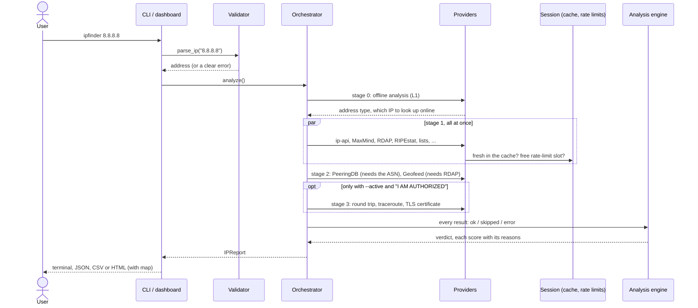

# IP Finder v2: architecture

এক কথায়: **একটা engine, দুটো দরজা।** Command line (`ipfinder`) আর web dashboard (`ipfinder serve`) দুটোই একই validator, orchestrator, ২৭টা provider, analysis engine আর output code ব্যবহার করে। Dashboard-এর জন্য আলাদা কোনো lookup logic নেই।

---

## একটা lookup-এর যাত্রা

1. **Validator** (`core/validator.py`) text থেকে address বানায়। `8.8.8.8:53`, `[2001:db8::1]:443`, URL, integer, বাংলা সংখ্যা সব নেয়। কিন্তু অস্পষ্ট লেখা (যেমন `010.1.1.1`) আন্দাজে পড়ে না, কারণ ব্যাখ্যা করে error দেয়।
2. **Stage 0: offline analysis** (L1) আগে চলে, আর ঠিক করে online source-গুলো আদৌ চলবে কিনা, চললে কোন address-এ। Private বা CGNAT address হলে online lookup হয় না। Teredo বা 6to4 হলে ভেতরের IPv4-এর lookup হয়।
3. **Stage 1:** যে source-গুলো একে অপরের উপর নির্ভর করে না, সেগুলো একসাথে চলে (`asyncio.gather`)।
4. **Stage 2:** যেগুলোর stage 1-এর তথ্য লাগে: PeeringDB-র লাগে ASN, Geofeed-এর লাগে RDAP record-এর link।
5. **Stage 3:** active probe। শুধু `--active` আর confirmation-এর পরে চলে, আর passive lookup শেষ হওয়ার পরে, যাতে তাদের traffic round-trip time-এ প্রভাব না ফেলে।
6. **Analysis engine** (`analysis/verdict.py`) সব ফল মিলিয়ে verdict বানায়। প্রতিটা score-এর সাথে কোন নিয়মে কত point, সেটা লেখা থাকে।

একটা source fail করলে (timeout, error, bug) বাকিগুলো চলতে থাকে। সেই source-এর ফল হয় `error`, আর কারণ লেখা থাকে (`core/orchestrator.py`-এর `_run`)।

---

## Folder ও দায়িত্ব

| Folder | দায়িত্ব | গুরুত্বপূর্ণ file |
|---|---|---|
| `ipfinder/core/` | Input, settings, run-এর shared জিনিস | `validator.py`, `special_ranges.py` (IANA table), `orchestrator.py`, `session.py`, `cache.py`, `ratelimit.py`, `http.py` |
| `ipfinder/providers/` | ২৭টা source, প্রতিটা একটা প্রশ্নের উত্তর দেয় | `base.py` (contract), `__init__.py` (registry) |
| `ipfinder/lists/` | Download করা list: যাচাই করে তবেই বদলায়, prefix index | `specs.py`, `store.py`, `index.py`, `maxmind.py` |
| `ipfinder/analysis/` | Offline বিশ্লেষণ আর verdict | `offline.py`, `ipv6_insights.py`, `geo.py`, `classify.py`, `scoring.py`, `rtt.py`, `verdict.py` |
| `ipfinder/active/` | Active probe (শুধু `--active`) | `probes.py`, `x509.py` |
| `ipfinder/output/` | Terminal, JSON, CSV, HTML report | `terminal.py`, `html_report.py`, `assets/` |
| `ipfinder/web/` | Web dashboard (ঐচ্ছিক) | `app.py`, `static/` |
| `ipfinder/cli.py` | Command line | |

---

## Provider-এর contract

প্রতিটা source `providers/base.py`-এর `Provider` class থেকে আসে, আর নিজের সম্পর্কে এগুলো ঘোষণা করে:

| Field | মানে |
|---|---|
| `name`, `layer` | যেমন `ripestat`, `L5` |
| `stage` | 0, 1, 2 বা 3 (উপরে দেখুন) |
| `profiles` | কোন profile-এ চলে: `quick`, `standard`, `full` |
| `requires_key` / `optional_key` | `.env`-এর কোন key লাগে |
| `local` | শুধু এই computer-এর file থেকে উত্তর দেয় (`--offline`-এ চলে) |
| `active` | Target-এ packet পাঠায় (শুধু `--active`-এ চলে) |
| `needs_public_ip` | Private address-এ চলবে না |
| `cache_ttl`, `rate_limit`, `timeout` | কতক্ষণ cache, কত দ্রুত, কতক্ষণ অপেক্ষা |

কোনো provider কেন চলল না, সেটা `unavailable_reason()` আর `skip_reason()` থেকে আসে। কারণগুলো report-এর Sources অংশে হুবহু দেখায়, যেমন "no API key (ABUSEIPDB_API_KEY in .env)" বা "offline mode: this source would send the address over the network"।

নতুন source যোগ করতে একটা class লিখে `providers/__init__.py`-এর `default_providers()`-এ বসাতে হয়। Orchestrator, cache, rate limiter আর `sources` command বাকিটা নিজেই সামলায়।

---

## কোন mode-এ address-টা কে দেখতে পায়

এই table code থেকে মিলিয়ে বানানো (`profiles`, `local`, `active` field আর প্রতিটা provider-এর URL)।

| Mode | Address (বা তার তথ্য) কে পায় |
|---|---|
| `--offline` | **কেউ না।** শুধু L1 বিশ্লেষণ, GeoLite2 file আর আগে নামানো list চলে। Test-এ যাচাই করা যে একটাও HTTP request বা DNS query যায় না। |
| `--profile quick` | ip-api.com। Free tier শুধু HTTP দেয়, তাই পথের যে কেউ address-টা দেখতে পারে। |
| `--profile standard` (default) | ip-api; IPinfo (token থাকলে); Team Cymru (DNS query, আপনার DNS resolver হয়ে); RDAP-এর জন্য IANA ও সংশ্লিষ্ট RIR; RIPEstat; Shodan InternetDB। Reverse DNS query যায় আপনার resolver হয়ে **address-এর মালিকের DNS server-এ**, তাই network-এর মালিক দেখতে পারে কেউ তার address দেখছে। PeeringDB পায় শুধু ASN, address নয়। Geofeed-এর জন্য operator-এর file নামানো হয়, address পাঠানো হয় না। |
| `--profile full` | উপরের সব, আর AbuseIPDB, GreyNoise, VirusTotal, AlienVault OTX, ThreatFox, URLhaus, Spamhaus (DNS)। তাই এগুলো default-এ বন্ধ। |
| `--active` | **Target নিজে** (TCP handshake, ping, traceroute, TLS)। `IPFINDER_LOCATION` না দিলে আপনার নিজের অবস্থান জানতে ip-api, আর traceroute-এর প্রতিটা hop-এর network জানতে Team Cymru। |

Cache আর download করা list `data/`-এ থাকে, যা `.gitignore`-এ আছে। তাই কোনো lookup history repo-তে যায় না।

---

## Session: একটা run-এ সব কিছু একবার

`core/session.py`-এর `Session` একটা run-এর shared জিনিসগুলো রাখে:

- একটা HTTP client (connection reuse, environment-এর proxy setting)।
- DNS resolver।
- SQLite cache, যেখানে প্রতিটা source-এর আলাদা TTL।
- Rate limiter (ip-api: মিনিটে 45টা, আধা সেকেন্ড margin সহ; server-এর `X-Rl`/`X-Ttl` header আর HTTP 429 মানে)।
- একবার parse করা list আর খোলা MaxMind file।

CLI প্রতি run-এ একটা session বানায়। Web dashboard পুরো server-এর জন্য একটাই session রাখে, আর প্রতিটা request `with_config()` দিয়ে নিজের profile নিয়ে সেটাই ভাগ করে। ফলে ip-api-র limit সব browser tab মিলিয়ে মানা হয়।

---

## Output: একই তথ্য, চার রূপে

| Output | কার জন্য | বিশেষ সুরক্ষা |
|---|---|---|
| Terminal (`rich`) | মানুষ | Network থেকে আসা text-এর control character (যেমন ESC) `\x1b` হিসেবে দেখায়, terminal-কে নিয়ন্ত্রণ করতে পারে না |
| JSON | অন্য program | সব raw data আর প্রতিটা score-এর breakdown থাকে |
| CSV | Excel ও spreadsheet | `=`, `+`, `-`, `@` দিয়ে শুরু হওয়া text-এর আগে `'` বসে (formula injection) |
| HTML report | শেয়ার করা, offline দেখা | Leaflet আর Natural Earth file-এর ভেতরে; CSP শুধু দুটো script চালাতে দেয় (hash দিয়ে) |

Web dashboard HTML report-এর `section()` আর `ipfinder-map.js` হুবহু ব্যবহার করে, তাই দুই জায়গায় একই জিনিস একইভাবে দেখায়।

---

আরও: algorithm ও design-এর কারণ [REPORT.md](REPORT.md)-এ, viva-র প্রশ্নোত্তর [VIVA.md](VIVA.md)-এ, live demo [DEMO.md](DEMO.md)-এ।
